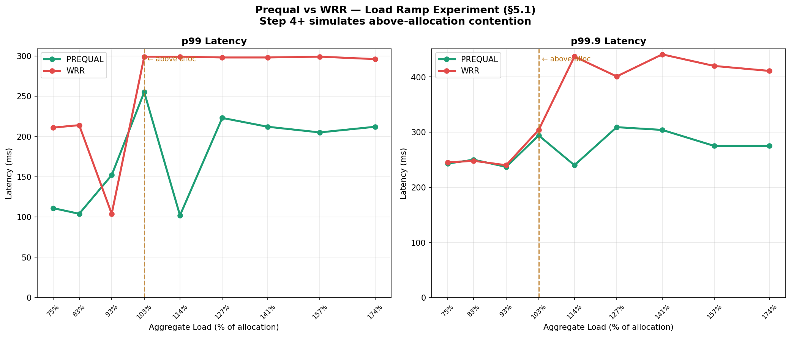
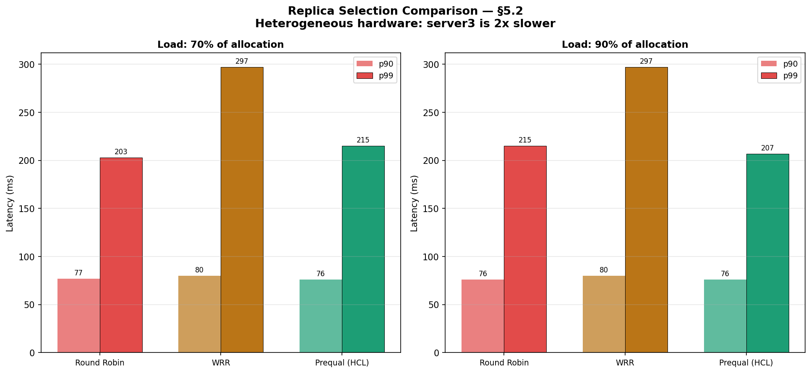

# Prequal Load Balancer

Implementation of Google's Prequal load balancing algorithm from the paper
[Load is not what you should balance: Introducing Prequal](https://www.usenix.org/conference/nsdi24/presentation/wydrowski)
(NSDI 2024 Wydrowski, Kleinberg, Rumble, Archer)

I built this as a learning project to understand how production load balancers
work at scale. The paper describes what Google deployed at YouTube and I tried
to implement the core ideas in Go.

## What is Prequal
Most load balancers distribute CPU load equally across servers. Prequal does
something different it routes each request to the server that has the most
capacity available right now, using two real-time signals:

- **RIF (Requests In Flight)** : an atomic counter showing how many requests
  a server is currently processing. Instantaneous, no averaging.
- **Latency** :  median response time at the current load level, tracked in
  buckets by RIF value.

The key insight from the paper: CPU utilization is a trailing signal. It takes
30 to 60 seconds to react to overload. RIF is instantaneous. When a server gets
throttled by other processes sharing its machine, requests pile up and RIF
rises immediately on the next probe.

## How It Works

### The HCL Rule

Prequal uses the Hot-Cold Lexicographic (HCL) rule for routing decisions:

1. Compute θRIF the 84th percentile of RIF values across the probe pool
2. Classify servers as cold (RIF ≤ θRIF) or hot (RIF > θRIF)
3. If cold servers exist route to the cold server with lowest latency
4. If all servers are hot route to the one with lowest RIF
5. If pool has fewer than 2 entries random fallback

The 84th percentile threshold means roughly the top 16% of servers by RIF
are classified as hot and avoided for latency-based routing.

### Async Probe Pool

Instead of probing servers on every request (which would add latency),
Prequal fires probes as background goroutines. Probes from request N
populate the pool for request N+k. Zero latency added to the critical path.

The pool has three failure mode defenses:
- **Staleness** : 1 second timeout discards old entries
- **Depletion**  : reuse budget formula keeps pool populated
- **Degradation** :  remove-worst process prevents bad entries accumulating

## Quick Start

```bash
git clone https://github.com/yourname/prequal
cd prequal
docker-compose up --build
```

Open:
- http://localhost:3000 :  Grafana dashboard (admin/admin)
- http://localhost:9090  : Prometheus
- http://localhost:8080/metrics : Raw metrics

The load generator starts automatically at 100 RPS. You should see all
8 dashboard panels updating within about 30 seconds.

## Running Without Docker

```bash
# terminal 1
go run cmd/server/main.go --id=server1 --port=9001 --base-delay=50ms

# terminal 2
go run cmd/server/main.go --id=server2 --port=9002 --base-delay=50ms

# terminal 3
go run cmd/server/main.go --id=server3 --port=9003 --base-delay=80ms

# terminal 4
go run cmd/lb/main.go \
  --backends=http://localhost:9001,http://localhost:9002,http://localhost:9003 \
  --algo=prequal

# terminal 5
go run cmd/gen/main.go --rps=100 --dur=60s
```

## Demo — Seeing Prequal Work

With docker-compose running and Grafana open at http://localhost:3000:

```bash
# make server3 slow — simulates CPU contention from other processes
curl "http://localhost:9003/control?mode=slow"
```

Watch the Routing Distribution panel in Grafana. Within 1-2 seconds,
traffic to server3 drops to near zero. p99 latency stays flat.

```bash
# restore server3
curl "http://localhost:9003/control?mode=normal"

# test sinkhole prevention — server3 returns 500 errors
curl "http://localhost:9003/control?mode=error"
```

Watch the Backend Health panel  server3 drops to 0 immediately.
The load balancer catches the first 500 response and stops routing there.

```bash
# restore
curl "http://localhost:9003/control?mode=normal"
```

To compare with WRR, edit docker-compose.yml and change
`--algo=prequal` to `--algo=wrr`, then:

```bash
docker-compose up -d --no-deps --build lb
curl "http://localhost:9003/control?mode=slow"
```

With WRR, traffic continues going to server3 for 10-20 seconds before
the weights update. p99 spikes during that window.
## Experiments

I tried to replicate the experiments from §5.1 and §5.2 of the paper.
These are not exact replications  the paper ran on Google's production
infrastructure with real CPU allocation and antagonist processes. I am
simulating the key conditions on a laptop with Docker containers. The
numbers will not match the paper but the patterns should.

My simulation approach:
- "Above allocation contention" = injecting `mode=slow` on server3 (+200ms delay)
- "Heterogeneous hardware" = server3 has 80ms base delay vs 50ms for server1/server2
- "Load levels" = mapped to RPS values (100 RPS = 75% baseline)
- Each step runs for 20 seconds — the paper ran much longer at production scale

The results show the same directional patterns the paper describes 
Prequal reacts faster than WRR and achieves lower tail latency under
contention but the absolute numbers and the shape of the curves are
different from Figure 6 and Figure 7 in the paper.

### Load Ramp — Based on §5.1 / Figure 6

Ramps load from 75% to 174% in 9 steps. At step 4 (103%), server3 is
put into slow mode to simulate above-allocation CPU contention.

```bash
./scripts/load_ramp.sh prequal
./scripts/load_ramp.sh wrr

python3 scripts/plot.py \
  results/load_ramp_prequal_*.csv \
  results/load_ramp_wrr_*.csv
```

**My results:**

| Step | Load | Prequal p99 | WRR p99 |
|------|------|-------------|---------|
| 1 | 75% | 110ms | 210ms |
| 2 | 83% | 104ms | 215ms |
| 3 | 93% | 153ms | 104ms |
| 4 | 103% contention injected | 255ms | 300ms |
| 5 | 114% | 101ms | 297ms |
| 6 | 127% | 224ms | 298ms |
| 7 | 141% | 212ms | 298ms |
| 8 | 157% | 204ms | 297ms |
| 9 | 174% | 213ms | 295ms |



The pattern matches what the paper describes — WRR's p99 jumps at
step 4 and never recovers. Prequal spikes briefly then recovers by
step 5. From step 5 onwards Prequal is consistently lower.

In the real paper the difference is more dramatic because actual CPU
throttling from antagonists is harder to recover from than my +200ms
simulation. My WRR also does not fully collapse the way the paper
shows partly because Docker containers on a laptop do not have the
same CPU contention dynamics as shared datacenter machines.

### Replica Selection — Based on §5.2 / Figure 7

Tests three algorithms at two load levels with server3 running slower
to simulate heterogeneous hardware.

```bash
./scripts/replica_selection.sh

python3 scripts/plot_replica_selection.py \
  results/replica_selection_*.csv
```

**My results:**

| Algorithm | Load 70% p99 | Load 90% p99 |
|-----------|-------------|-------------|
| Round Robin | 203ms | 215ms |
| WRR | 297ms | 297ms |
| Prequal (HCL) | 215ms | 207ms |



The paper tests nine different policies. I only implemented three 
Round Robin, WRR, and Prequal. The paper also includes policies like
Least Loaded, Join Idle Queue, and C3 which I did not implement.

The WRR-worse-than-Round-Robin result was unexpected but matches what
the paper describes in §5.2  miscalibrated weights can be worse than
uniform random distribution when the weight update lag is large relative
to how fast server conditions change.

Prequal achieves the lowest p99 at both load levels which matches the
paper's conclusion that HCL-based routing outperforms all other tested
policies on heterogeneous hardware.

## Grafana Dashboard

Eight panels showing live system state:

| Panel | What it shows |
|-------|---------------|
| Request Latency p50/p99/p99.9 | End-to-end tail latency |
| Requests per Second | Throughput and error rate |
| RIF per Backend | Current queue depth per server |
| Routing Distribution | How traffic is split across servers |
| Latency Estimate per Backend | Real-time signal Prequal uses |
| Backend Health | 1 = healthy, 0 = unhealthy |
| Probe Pool Size | How full the probe pool is |
| Pool Removals by Reason | Which pool defenses are active |

## Server Control Endpoints

Used for experiments and demos:

```bash
curl "http://localhost:900X/control?mode=normal"  # restore
curl "http://localhost:900X/control?mode=slow"    # adds 200ms delay
curl "http://localhost:900X/control?mode=error"   # returns 500s
curl "http://localhost:900X/control?mode=cpu"     # burns CPU
curl "http://localhost:900X/control?mode=kill"    # exits process
```

## Load Balancer Flags

```
--backends   comma-separated backend URLs
--algo       prequal (default) or wrr or rr
--qrif       QRIF quantile threshold (default 0.84)
--rprobe     probes per query (default 2.0)
--rremove    pool removals per query (default 1.0)
--delta      pool drift factor (default 1.0)
--port       listen port (default 8080)
```

## What I Learned

Building this helped me understand a few things I did not expect:

The most surprising result from the paper  which also showed up in
my experiments is that linear combinations of RIF and latency
perform worse than RIF alone, and RIF alone performs worse than the
threshold-based HCL rule. The paper proves this in Appendix A.
Intuitively it makes sense: a linear combination can route to an
overloaded server if its latency looks temporarily good. HCL's binary
hot/cold gate prevents this entirely.

The async probe pool was harder to implement correctly than I expected.
The three failure modes (staleness, depletion, degradation) interact
in non-obvious ways. Getting the reuse budget formula right so the
pool stays populated without going stale took several iterations.

The WRR-worse-than-Round-Robin result in the replica selection
experiment was unexpected but makes sense once you think about it.
EWMA weights that are slightly wrong are sometimes worse than
uniform random distribution.

## Paper Reference

Bartek Wydrowski, Robert Kleinberg, Stephen M. Rumble, Aaron Archer.
**Load is not what you should balance: Introducing Prequal.**
NSDI 2024.
https://www.usenix.org/conference/nsdi24/presentation/wydrowski